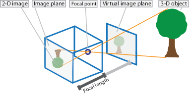
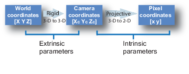
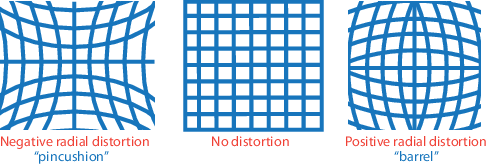

# Kinect-ASUS-Xtion-Pro-Live-Calibration-Tutorials
<script type="text/javascript" src="http://cdn.mathjax.org/mathjax/latest/MathJax.js?config=default"></script>

### Preparation
#### Installation
* Enter the following codes in your terminal

```bash
sudo apt-get install ros-indigo-openni-camera
sudo apt-get install ros-indigo-openni-launch
```

* Remember to modify `GlobalDefaults.ini` if you are using Asus Xtion Pro Live
```bash
sudo gedit /etc/openni/GlobalDefaults.ini
```
then uncomment the line: `;UsbInterface=2` (just delete the `;` symbol)

#### Test your Asus Xtion Pro Live with ROS

* To view the rgb image:
```bash
roslaunch openni_launch openni.launch
rosrun image_view image_view image:=/camera/rgb/image_raw
```

* To visualize the depth_registered point clouds:

```bash
roslaunch openni_launch openni.launch depth_registration:=true
rosrun rviz rviz
```

### A Brief Review of Camera Model
Camera can be modeled with a pinhole camera model and len distortion.
#### Pinhole Model
A pinhole camera is a simple camera without a lens and with a single small aperture. Light rays pass through the aperture and project an inverted image on the opposite side of the camera. Think of the virtual image plane as being in front of the camera and containing the upright image of the scene.



The pinhole camera parameters are represented in a 3-by-4 matrix called the camera matrix (or projection matrix). This matrix maps the 3-D world scene into the image plane. The calibration algorithm calculates the camera matrix using the extrinsic and intrinsic parameters. The extrinsic parameters represent the location of the camera in the 3-D scene. They represent a rigid transformation from 3-D world coordinate system to the 3-D camera's coordinate system. The intrinsic parameters represent the optical center and focal length of the camera. They represent a projective transformation from the 3-D camera's coordinates into the 2-D image coordinates.



[latex]
\begin{align}
\lambda
\begin{bmatrix}
u \\
v \\
1 \\
\end{bmatrix}
=\begin{bmatrix}
f_x & s & c_x\\
0 & f_y & c_y\\
0 & 0 & 1\\
\end{bmatrix}
\begin{bmatrix}
R&T
\end{bmatrix}
\begin{bmatrix}
X\\
Y\\
Z\\
1\\
\end{bmatrix}
=K\begin{bmatrix}
R&T
\end{bmatrix}
\begin{bmatrix}
X\\
Y\\
Z\\
1\\
\end{bmatrix}
=P\begin{bmatrix}
X\\
Y\\
Z\\
1\\
\end{bmatrix}
\end{align}
[/latex]
where [latex]
\begin{align}
\begin{bmatrix}
X\\
Y\\
Z\\
\end{bmatrix}
\end{align} [/latex]is the point coordinates in the world coordinate system, [latex]\begin{align}\begin{bmatrix}u \\v \\\end{bmatrix}\end{align} [/latex]is the point coordinates (pixel) in the image coordinate system, [latex]\lambda[/latex] is a scale factor(depth), [latex]f_x, f_y[/latex] are the focal length in pixels, [latex]c_x, c_y[/latex] are the optical center in pixels, [latex]s[/latex] is the skew coefficient, [latex] K [/latex] contains the intrinsic parameters,  [latex]
\begin{align}
\begin{bmatrix}
R&T\\
\end{bmatrix}
\end{align}
[/latex] contains the extrinsic parameters, [latex]P[/latex] is the projection matrix.

#### Distortion in Camera
The camera matrix does not account for lens distortion because an ideal pinhole camera does not have a lens. To accurately represent a real camera, the camera model includes the radial and tangential lens distortion.



We need to takes into account the radial and tangential factors.
For the radial factor one uses the following formula:
[latex]\begin{equation}
x_{corrected} = x(1 + k_1r^2 + k_2r^4 + k_3r^6)\\
y_{corrected} = y(1 + k_1r^2 + k_2r^4 + k_3r^6) \end{equation}[/latex]
For the tangential distortion one uses the following formula:
[latex]\begin{equation}
x_{corrected} = x + [2p_1xy + p_2(r^2 + 2x^2)]\\
y_{corrected} = y + [p_1(r^2 + 2y^2) + 2p_2xy]\end{equation}[/latex]
So for an old pixel point at [latex](x, y)[/latex] coordinates in the input image, its position on the corrected output image will be [latex](x_{corrected},  y_{corrected})[/latex].


### Calibrate Intrinsics
ROS provides an easy-to-use package that allows us to calibrate monocular camera. To calibrate the kinect intrinsics, we need to calibrate both the RGB camera as well as the IR camera. The Kinect detects depth by using an IR camera and IR speckle projector as a pseudo-stereo pair. We will calibrate the "depth" camera by detecting checkerboards in the IR image, just as we calibrated the RGB camera.

#### RGB Camera
Bring up the OpenNI driver:
```bash
roslaunch openni_launch openni.launch
```
Now follow the standard [monocular camera calibration instructions](http://wiki.ros.org/camera_calibration/Tutorials/MonocularCalibration). Use the following command (**substituting the correct dimensions of your checkerboard**):
```bash
rosrun camera_calibration cameracalibrator.py image:=/camera/rgb/image_raw camera:=/camera/rgb --size 8x6 --square 0.0245
```
Don't forget to Commit your successful calibration.

#### IR(depth) Camera
The speckle pattern makes it impossible to detect the checkerboard corners accurately in the IR image. 


The simplest solution is to cover the projector (lone opening on the far left) with one or two Post-it notes, mostly diffusing the speckles. An ideal solution is to block the projector completely and provide a separate IR light source. 
```bash
rosrun camera_calibration cameracalibrator.py image:=/camera/ir/image_raw camera:=/camera/ir --size 8x6 --square 0.0245
```
The Kinect camera driver cannot stream both IR and RGB images. It will decide which of the two to stream based on the amount of subscribers, so kill nodes that subscribe to RGB images before doing the IR calibration.Don't forget to Commit your successful calibration.

 When you click Commit, cameracalibrator.py sends the new calibration to the camera driver as a service call. The driver immediately begins publishing the updated calibration on its camera_info topic. **openni_camera** uses camera_info_manager to manage calibration parameters. By default, it saves intrinsics to $HOME/.ros/camera_info/NAME.yaml and identifies them by the device serial number:
```bash
$ ls $HOME/.ros/camera_info
depth_1504270110.yaml  rgb_1504270110.yaml
```

### Calibrate Extrinsics
This is essentially a Perspective-n-Point (PnP) problem. 
We know that: 
[latex]
\begin{align}
\lambda
\begin{bmatrix}
u \\
v \\
1 \\
\end{bmatrix}
=P\begin{bmatrix}
X\\
Y\\
Z\\
1\\
\end{bmatrix}
\end{align} [/latex] [latex],[/latex][latex] \begin{align}
P=
K\begin{bmatrix}
R&T\\
\end{bmatrix}
\end{align}
[/latex]
Therefore, if we know enough points with known world coordinates and pixel coordinates, we can solve [latex]P[/latex]. Since we've just calibrated the intrinsics, we can now get[latex] \begin{align}\begin{bmatrix}
R&T\\
\end{bmatrix}
\end{align}[/latex].

OpenCV provides a handy function named `solvePnPRansac` which can solve this problem. To use that function, we need to provide enough points with their world coordinates as well as their correspondent pixel coordinates, intrinsic matrix, and distortion coefficients. You can see detailed implementation in **get_extrinsics.py**. To run this file, you need to change some parameters including the file directory to read in the intrinsic calibration result and output extrinsic calibration result, chessboard square width, the size of the chessboard. Notice that we need to get both the RGB and IR camera extrinsic parameters. However, we cannot get rgb image and ir image simultaneously if we are using openni_launch as the camera driver. Therefore, we need to calibrate one by one. Comment the other subscription to get the extrinsic parameters for each  camera.

**pose_estimation.py** is just a tiny program that will show you your current pose relative to the chessboard. It will show the world coordinate system with its three axises (x-axis, y-axis, and z-axis). As you move the chessboard, the axises move together and remain on the same position on the chessboard. 

**One note here**:
The extrinsic matrix [latex]
\begin{align}\begin{bmatrix}
R&T\\
\end{bmatrix}
\end{align}
[/latex] describes how to transform points in world coordinates to camera coordinates.  The vector [latex] T[/latex] can be interpreted as the position of the world origin in camera coordinates, and the columns of [latex]R[/latex] represent the directions of the world-axes in camera coordinates. It describes how the world is transformed relative to the camera. This is often counter-intuitive, because we usually want to specify how the camera is transformed relative to the world. It's often more natural to specify the camera's pose directly rather than specifying how world points should transform to camera coordinates. Luckily, building an extrinsic camera matrix this way is easy: just build a rigid transformation matrix that describes the camera's pose and then take it's inverse.

Let [latex]C[/latex] be a column vector describing the location of the camera-center in world coordinates, and let [latex]R_c[/latex] be the rotation matrix describing the camera's orientation with respect to the world coordinate axes. The transformation matrix that describes the camera's pose is then [latex]\begin{align}\begin{bmatrix}R_c & C\end{bmatrix}\end{align}[/latex]. Like before, we make the matrix square by adding an extra row of [latex]\begin{align}\begin{bmatrix}0& 0 & 0 & 1\end{bmatrix}\end{align}[/latex]. Then the extrinsic matrix is obtained by inverting the camera's pose matrix:
 [latex]
\begin{align}
\begin{bmatrix}
R & T\\
0 & 1
\end{bmatrix}& =\begin{bmatrix}
R_c & C\\
0 & 1
\end{bmatrix}^{-1}\\
& =\begin{bmatrix}
\begin{bmatrix}
I&C\\
0&1\\
\end{bmatrix}
\begin{bmatrix}
R_c&0\\
0&1\\
\end{bmatrix}
\end{bmatrix}^{-1}\\
&=\begin{bmatrix}
R_c&0\\
0&1\\
\end{bmatrix}^{-1}
\begin{bmatrix}
I&C\\
0&1\\
\end{bmatrix}^{-1}\\
&=\begin{bmatrix}
R_c^{T}&0\\
0&1\\
\end{bmatrix}
\begin{bmatrix}
I&-C\\
0&1\\
\end{bmatrix}\\
&=\begin{bmatrix}
R_c^T&-R_c^TC\\
0&1
\end{bmatrix}
\end{align}
[/latex]

### Register Depth to RGB
To get aligned depth image and rgb image, we need to register depth image to rgb image. The first thing we need to do is to get the transformation matrix between the ir(depth) camera and rgb camera. 
[latex]
\begin{align}
Q_{rgb}=
\begin{bmatrix}
R_{rgb} & T_{rgb}\\ 
\end{bmatrix}
\times
\begin{bmatrix}
X \\
Y \\
Z \\
1\\
\end{bmatrix}
=
\begin{bmatrix}
R_{rgb} & T_{rgb}\\ 
\end{bmatrix}
\times \begin{bmatrix}
Q\\
1\\
\end{bmatrix}
=R_{rgb}Q + T_{rgb}
\end{align} 
[/latex]

[latex]
\begin{align}
Q_{ir}=
\begin{bmatrix}
R_{ir} & T_{ir}\\ 
\end{bmatrix}
\times
\begin{bmatrix}
X \\
Y \\
Z \\
1\\
\end{bmatrix}
=
\begin{bmatrix}
R_{ir} & T_{ir}\\ 
\end{bmatrix}
\times \begin{bmatrix}Q\\
1\\
\end{bmatrix}
=R_{ir}Q + T_{ir}
\end{align} 
[/latex]
We can get from the above equations that:
[latex]
\begin{align}
Q_{rgb}&=R_{rgb}R_{ir}^{-1}(Q_{ir}-T_{ir})+T_{rgb}\\
&=R_{rgb}R_{ir}^{-1}Q_{ir}+T_{rgb}-R_{rgb}R_{ir}^{-1}T_{ir}
\end{align}
[/latex]
As we know that the transformation between the ir camera and rgb camera can be expressed as [latex]Q_{rgb} = R_{ir\_to\_rgb}Q_{ir}+T_{ir\_to\_rgb}[/latex], comparing these equations, we can get:
[latex] R_{ir\_to\_rgb} = R_{rgb}R_{ir}^{-1} \\ T_{ir\_to\_rgb} = T_{rgb}-R_{rgb}R_{ir}^{-1}T_{ir} = T_{rgb}-RT_{ir} [/latex]
We've got the [latex]R_{ir}, T_{ir}, R_{rgb}, T_{rgb}[/latex] in the previous section. Hence, we can get [latex] R_{ir\_to\_rgb}, T_{ir\_to\_rgb}[/latex] which are just the rotation matrix and translation matrix  between ir camera and rgb camera.
Now, we can register the depth image to rgb image. 
For each pixel point [latex]\begin{align}\begin{bmatrix}u\\v\end{bmatrix}\end{align}[/latex] on the depth image, we do the following transformation:
<li>Transform the point's pixel coordinates in the depth image to the coordinates in the ir(depth) camera-centered coordinate system
 [latex]
\begin{align}
\begin{bmatrix}
x_{ir}\\
y_{ir}\\
z_{ir}\\
\end{bmatrix}=K^{-1}\lambda\begin{bmatrix}
u_{ir}\\
v_{ir}\\
1\\
\end{bmatrix}
\end{align}
[/latex]
[latex]\lambda[/latex] here is actually just the z coordinate(depth) of this point.
</li>
<li>Transform the point's coordinates in the ir(depth) camera-centered coordinate system to coordinates in the rgb camera-centered coordinate system
 [latex]
\begin{align}
\begin{bmatrix}
x_{rgb}\\
y_{rgb}\\
z_{rgb}\\
\end{bmatrix}=R_{ir\_to\_rgb}
\begin{bmatrix}
x_{ir}\\
y_{ir}\\
z_{ir}\\
\end{bmatrix}
+T_{ir\_to\_rgb}
\end{align}
[/latex]
</li>
<li>Transform the point's coordinates in the rgb camera-centered coordinate system to coordinates in rgb image
 [latex]
\begin{align}
\begin{bmatrix}
u_{rgb}\\
v_{rgb}\\
1\\
\end{bmatrix}=\frac{1}{z_{rgb}}K\begin{bmatrix}
x_{rgb}\\
y_{rgb}\\
z_{rgb}\\
\end{bmatrix}
\end{align}
[/latex]

Finally, we get the correspondent point of depth image in rgb image. You need to carefully implement the aforementioned procedures. It's better to implement these in a **matrix-operation** way instead of multiple for loops.  Too many for loops will dramatically slow down the running speed. The detailed implementation is in **registration.py**. Again,  you need to change some parameters including the file directory to read in the intrinsic calibration result and extrinsic calibration result, chessboard square width, the size of the chessboard.

### The easy way:
Openni_launch has already taken care of all the abovementioned problems. You just need to subscribe **/camera/depth_registered/hw_registered/image_rect** to get the registered and rectified depth image and **/camera/rgb/image_rect_color** to get the rectified rgb images. They have good alignment to each other. The **image_to_world.py** allows you to select a region( a rectangle region) on the rgb image, and it will show the center point in red on the rgb image, output this point's world coordinates in the terminal. You can then verify how the accuracy of kinect.


### References:
* [Kinect Calibration](http://burrus.name/index.php/Research/KinectCalibration)
* [Kinect Calibration_ros](http://wiki.ros.org/kinect_calibration/technical)
* [Kinect Calibration_github](https://github.com/robbeofficial/KinectCalib)
* [kinect intrinsic calibration](http://wiki.ros.org/openni_launch/Tutorials/IntrinsicCalibration)
* [kinect calibration technical](http://wiki.ros.org/kinect_calibration/technical)
* [depth_rgb_alignment](https://www.codefull.org/2016/03/align-depth-and-color-frames-depth-and-rgb-registration/)
* [camera calibration](http://www.ics.uci.edu/~majumder/VC/classes/cameracalib.pdf)
* [camera calibration](http://ais.informatik.uni-freiburg.de/teaching/ws09/robotics2/pdfs/rob2-08-camera-calibration.pdf)
* [camera coordinate system](http://wiki.ros.org/image_pipeline/CameraInfo)
* [what does the projection matrix mean?](http://answers.ros.org/question/119506/what-does-projection-matrix-provided-by-the-calibration-represent/)
* [CameraInfo Message](https://mirror.umd.edu/roswiki/doc/diamondback/api/sensor_msgs/html/msg/CameraInfo.html)
* [Kinect Registration](http://blog.csdn.net/aichipmunk/article/details/9264703)
* [Extrinsic Matrix](http://ksimek.github.io/2012/08/22/extrinsic/)


